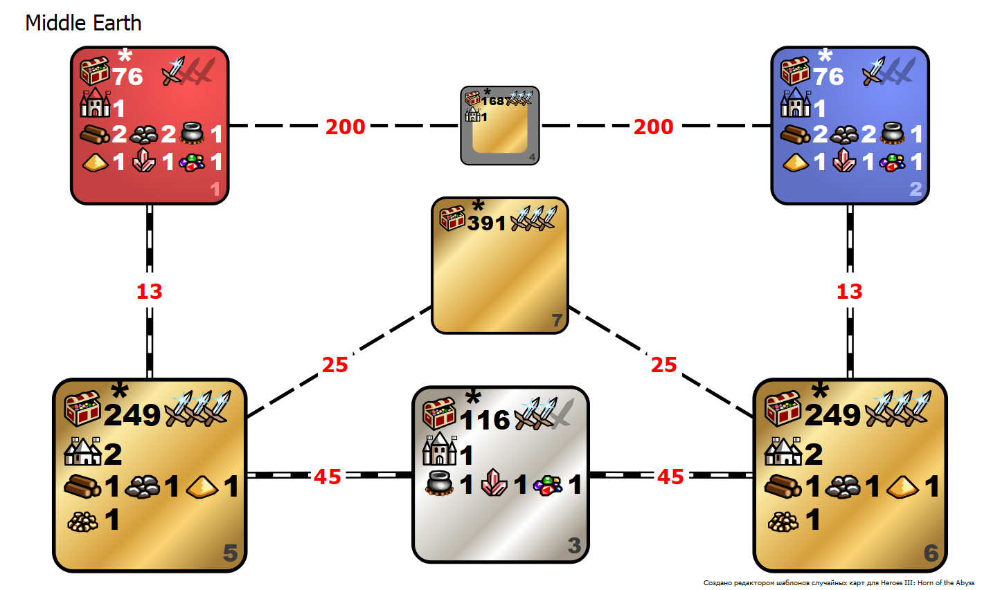

# Random map template (Heroes 3 - HotA)

The two sides decided to find out which of them is stronger. But only one problem - between 
them are neutral lands filled with dangerous creatures and the untold riches they guard. They 
say there is still a secret passage between the sides, but the path is thorny and risky, no 
one knows what awaits you on that path, you may need a guide or strong army. Welcome to the
**Middle Earth**.

### Installation

1. Clone repository
2. Put folder `Middle Earth` to the folder `HotA_RMGTemplates` in Heroes 3 - HotA root folder
3. Start the game  
	3.1. Choose singleplayer (or multiplayer)  
	3.2. Select random map mode  
	3.3. Find out and choose `Middle Earth (2p, XL)` template  
4. Set up game and start as usual

### Rules

_Rules is under correction now. Coming soon..._

* Initial set up: fast roads, no water, normal monsters, 160%.
* You have to play with 1 hero which was chosen at the beginning of game. 
You are defeated if you lose this hero (in any way).  
    * If two heroes are lost (disappeared) after battle the winner is the player 
    who make the last shot (even if it was made by summoned creature or magic spell).  
    * If battle can't be finished (f.e. if two players have army of ghosts) the 
    winner is the player with bigger sum of characteristics (if sums are equal 
    then by tossing a coin).  
* Since **127** you can recruit one more hero from tavern. This actions is allowed only once, it means
that if you lose the second hero (even if it can surrender or retreat), you have to finish the game 
having only 1 (main) hero. The second hero **can't attack** opponent heroes and **can't be attacked**
with opponent heroes.  
    * Second hero can't block path on road if there is only 1 tile in width between
any obstacles. If second hero have no more move points and blocks the route then you have to banish him
(and never buy any other second heroes).  
* Player who can held battlefield castle (in zone 3) for 1 month since he captured this castle and write
to chat "I captured middle castle" is the winner. Player can capture that castle but doen't write message
to the chat. In this case timer will go since day when player decided to write specified message to chat.
* Each player have 1 restart until 112 (inclusive).

### Template

Scheme of this template:

* **Player zones (1-red, 2-blue)**. These zones are full of resources, mines, sawmills, just mills 
and monster buildings of 3 (x4), 4 (x2) and 5 (x2) levels. Seldom you can find hero improvement 
objects x3 for each kind of characteristics, and one library.
* **Player treasure zones (5-red, 6-blue)**. These zones are full of artifacts and boxes of the 
highest value. Also there are 2 towns (1 of them guaranteed that it has the same type as user home 
castle). This zone is always covered with sand to make exploration more difficult. In this zone 
there is not monster buildings at all.
* **Battlefield zone (3)**. This zone is planned as classical battlefield. There is almost nothing 
that can distract you from battle with your opponent. One thing that can really impact is that in
this zone hidden 5 relic artifacts and some black towers. Everything else is just a tower castle 
snow and some stone-like resources. And monsters (to boost your skeletons)!
* **Hidden treasure zone (7)**. If you think that home treasures is all that you can find on this
map then you are wrong. There is one more neutral treasure zone full of artifacts and some useful
buildings (may be). You can get to it from zones 5 and 6 through the portals in some edge of your
home treasure zone.
* **Terra incognita (4)**. Nobody knows what can be there. But they tell that it's the shortest
path between players and there is one stronghold castle. Might be that there is something else
but it's not exact. 

Example of generated map using this template is following:

### Artifacts

_Rules is under correction now. Coming soon..._

### Spells

_Rules is under correction now. Coming soon..._

### Heroes

_Rules is under correction now. Coming soon..._

* All heroes with specialization on monsters of 3, 4 and 5 levels are banned.
* All heroes with sea/ocean specializations are banned.
* All heroes with eagle eye specialization are banned.
* All heroes with travel specializations are banned.

### Skills

_Rules is under correction now. Coming soon..._

| Banned         | Motivation                                  || Allowed        | Motivation                                          |
|:---------------|:--------------------------------------------||:---------------|:----------------------------------------------------|
| Path finding   | Permanent pick due to many "bad" surfaces   || Shooting       | Classical skill                                     |
| Logistics      | Fastest roads should not be abused          || Exploration    | Map is big enough                                   |
| Diplomacy      | I don't know, may be it will become allowed || Leadership     | I like soup of skeletons and fairies                |
| Navigation     | Game should be on surface without water     || Wise           | Classical skill                                     |
| Mysticism      | Use wells or don't use a magic a lot        || Luck           | Just for fun                                        |
| Eagle eye      | Nobody choose this, don't waste your time   || Necromancy     | Skeletons, skeletons, skeletons, liches... liches?! |
| Magic of fire  | Berserk on all your army?                   || Eastate        | Too many wants, too little gold                     |
| Magic of wind  | I don't know, may be it will become allowed || Magic of water | I don't know how you can abuse this                 |
| Magic of earth | I'm lazy to write "why" for here            || Tactics        | Give a chance to warrior heroes stand for a berserk |
| Ballistics     | No attacks of well prepared castles         || Attack         | Classical skill                                     |
| Learning       | I don't know, may be it will become allowed || Literacy       | You can have a second hero and far placed castles   |
| First aid      | I don't know, may be it will become allowed || Armor          | Classical skill                                     |
|                |                                             || Intelligence   | If you don't like to drink water from well          |
|                |                                             || Magic          | Classical skill                                     |
|                |                                             || Resistance     | We! Are! RESISTANCE! Ommmmmm                        |
|                |                                             || Artillery      | Last chance or firstly killed unit in the battle    |
|                |                                             || Interference   | Nobody likes wizards with mana                      |

### Buildings

_Rules is under correction now. Coming soon..._