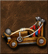
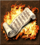
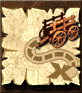
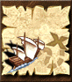
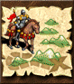

| | Skill | Status | Motivation |
|-|-------|--------|------------|
||Air Magic|:x:|I don't know, may be it will become allowed| 
||Archery|:white_check_mark:|Classical skill| 
||Armorer|:white_check_mark:|Classical skill|
||Artillery|:white_check_mark:|Last chance or firstly killed unit in the battle|
||Ballistics|:x:|No attacks of well prepared castles| 
||Diplomacy|:x:|I don't know, may be it will become allowed| 
||Eagle Eye|:x:|Nobody choose this, don't waste your time| 
||Earth Magic|:x:|Do you really need comments?| 
||Estates|:white_check_mark:|Too many wants, too little gold|
||Fire Magic|:x:|Do you want berserk on all your army?| 
||First Aid|:x:|I don't know, may be it will become allowed| 
||Intelligence|:white_check_mark:|If you don't like to drink water from a well| 
||Interference|:white_check_mark:|Nobody likes wizards with mana| 
||Leadership|:white_check_mark:|I like soup of skeletons and fairies| 
||Learning|:x:|I don't know, may be it will become allowed| 
||Logistics|:x:|Fastest roads should not be even more faster| 
||Luck|:white_check_mark:|Just for fun| 
||Mysticism|:x:|Use wells or don't use a magic a lot| 
||Navigation|:x:|Game should be on surface without water| 
||Necromancy|:white_check_mark:|Skeletons, skeletons, skeletons, liches... liches?!| 
||Offense|:white_check_mark:|Classical skill| 
||Pathfinding|:x:|Permanent pick due to many "bad" surfaces| 
||Resistance|:white_check_mark:|We! Are! RESISTANCE! Ommmmmm| 
||Scholar|:white_check_mark:|You can have a second hero and far placed castles| 
||Scouting|:white_check_mark:|Map is big enough| 
||Sorcery|:white_check_mark:|Classical skill| 
||Tactics|:white_check_mark:|Give a chance to warrior heroes stand for a berserk| 
||Water Magic|:x:|I don't know, may be it will become allowed| 
||Wisdom|:white_check_mark:|Classical skill| 